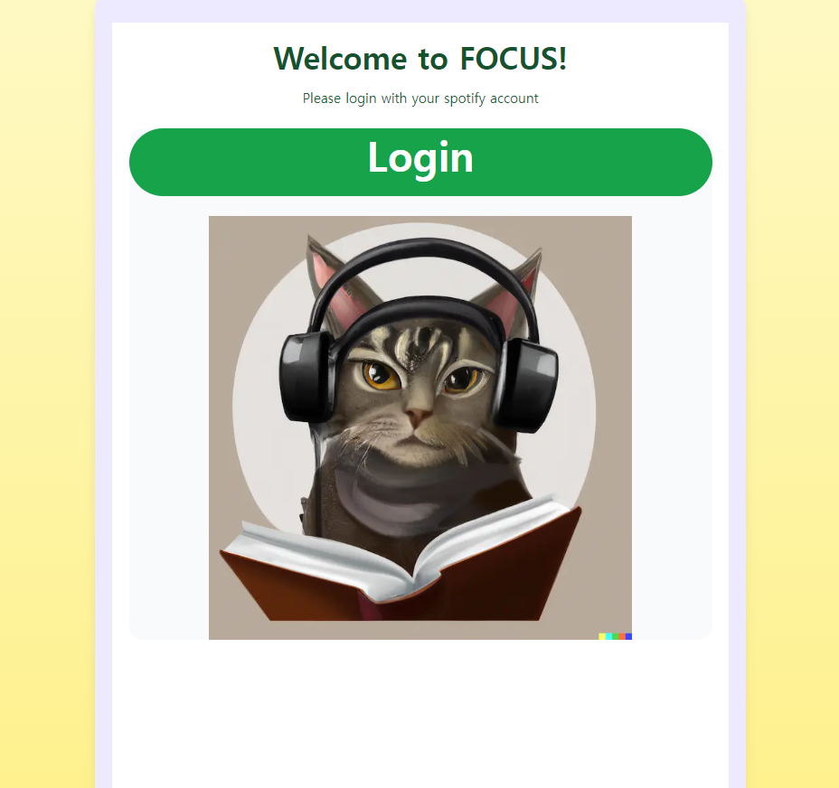
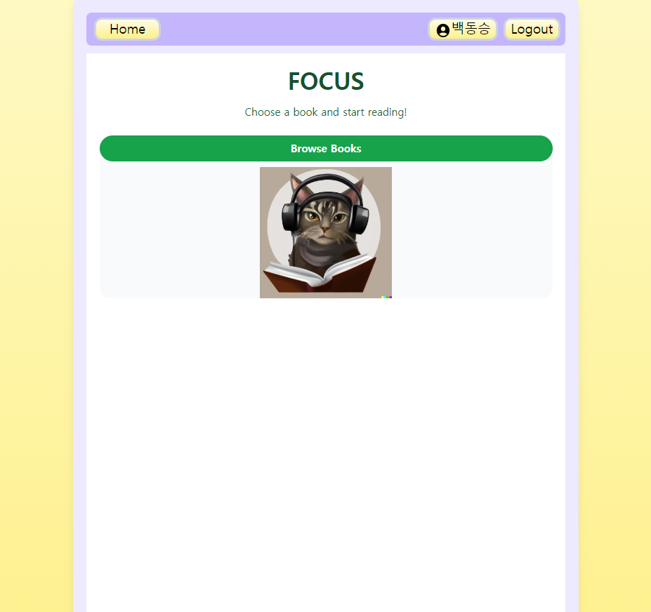
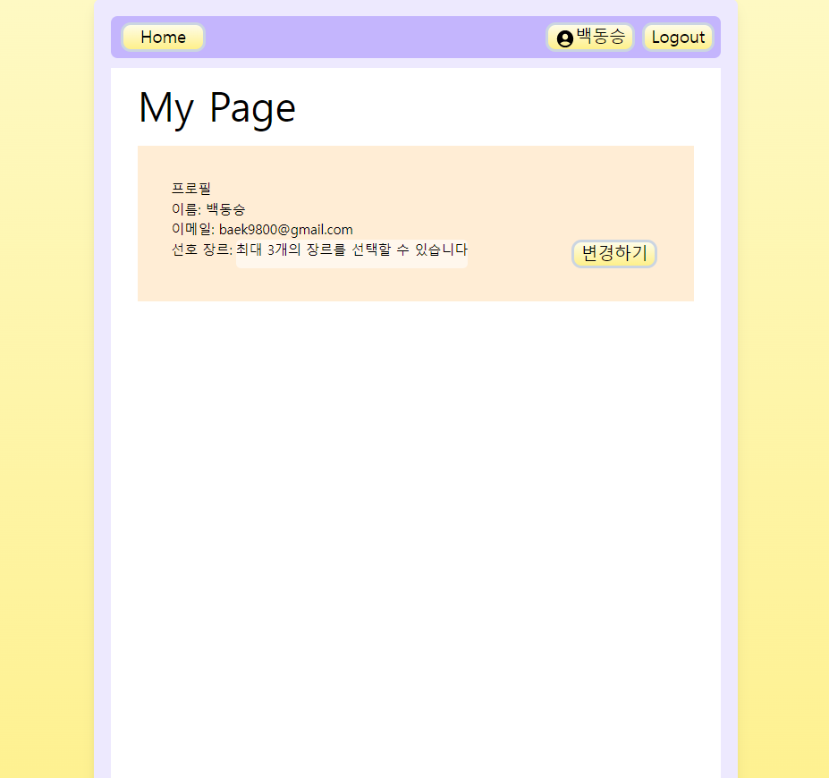
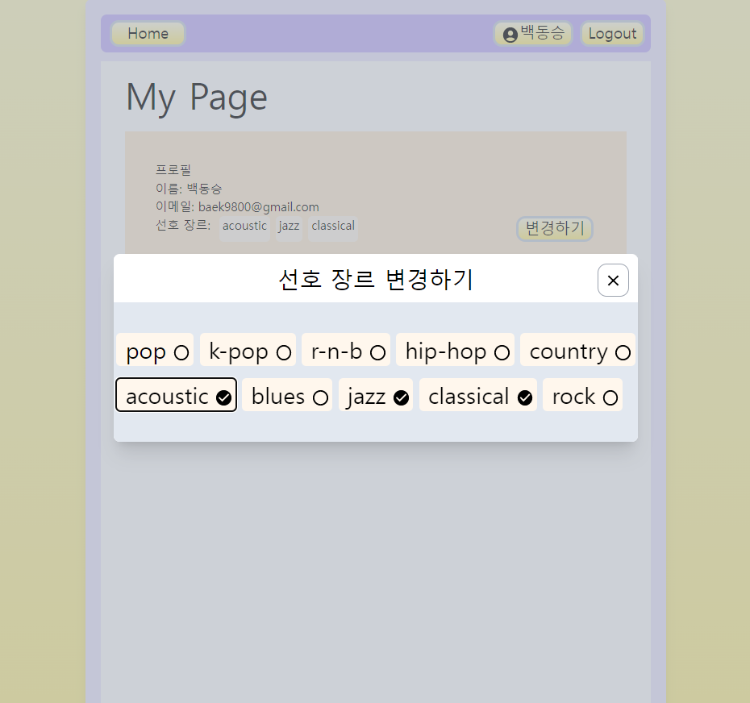
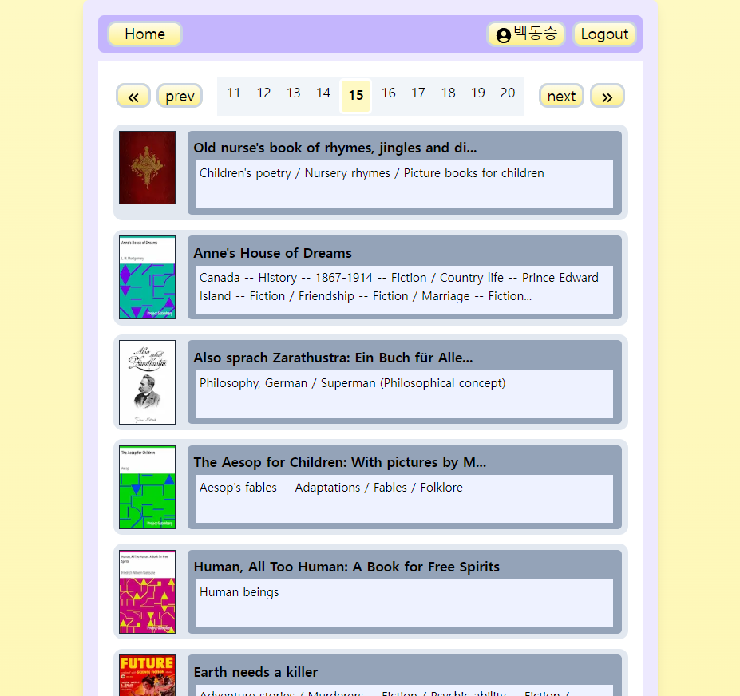
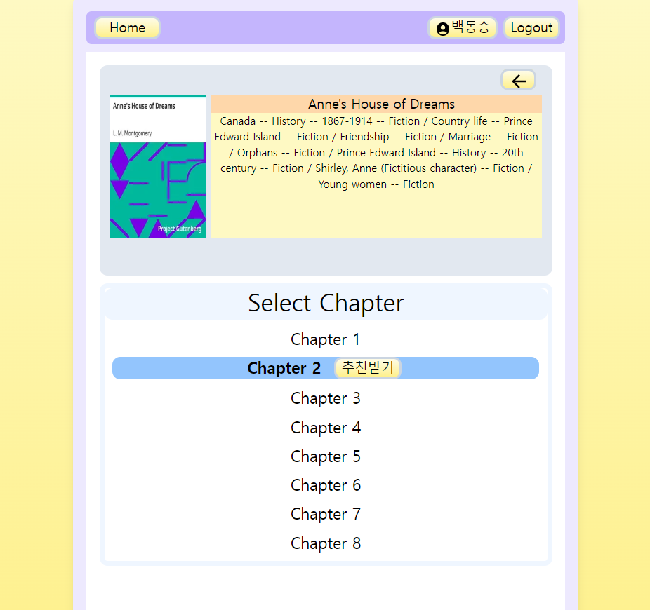
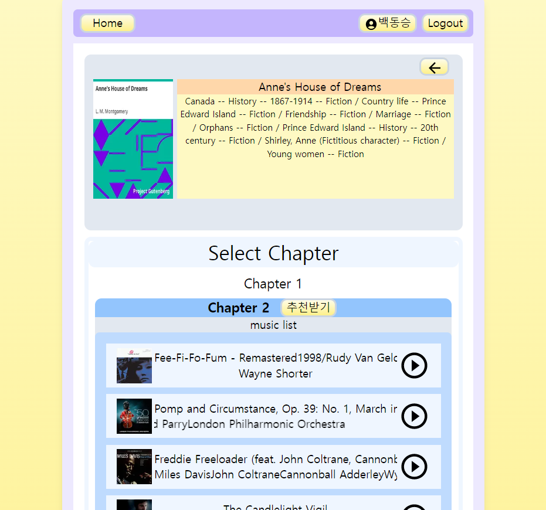

# focus

소설의 분위기와 어울리는 음악을 추천해주는 서비스

## 실행화면
* **로그인 화면** 
서비스의 로그인 페이지. 어느 페이지에서든 로그아웃을 하면 로그인 페이지로 리디렉트된다. 
</img>  
* **메인 페이지** 
서비스의 메인 페이지. 어느 페이지에서든 Home 버튼을 클릭하면 메인 페이지로 리디렉트된다. 
</img>  
* **마이 페이지** 
사용자 정보를 확인할 수 있는 페이지. 어느 페이지에서든 사용자 이름을 클릭하면 마이 페이지로 리디렉트된다. 
</img>  
* **장르 선택창** 
마이 페이지에서 장르변경을 클릭할 경우 생기는 모달창. 최대 세 개의 선호 장르를 선택할 수 있다. 
</img>  
* **책 리스트** 
음악을 추천받을 소설을 선택할 수 있는 페이지. 
</img>  
* **책 페이지** 
음악을 추천받을 챕터를 선택할 수 있는 페이지. 
</img>  
* **음악 추천창** 
추천받기 버튼을 클릭하면 사용자의 선호 장르의 곡들이 추천된다. 재생 버튼을 눌러 재생할 수 있다. 
</img>  

## 주요 이슈
**1. 사용자 정보 관리** 
nextAuth를 이용하여 Spotify 계정을 갖고있는 사용자들이 소셜로그인을 할 수 있도록 구현하였다. Spotify API에서 제공하는 사용자의 정보와 access token, refresh token, 그리고 사용자가 선택한 선호 장르를 context를 이용하여 모든 페이지에서 사용할 수 있도록 했고, http only 쿠키를 이용하여 사용자의 access token과 refresh token을 보관한다. Spotify API에 요청 시 access token 만료로 에러가 발생하면 refresh token을 이용해 access token을 재발급 받는다.  
**2. 소설 데이터** 
gutenberg.org에서 제공하는 저작권이 만료된 고전소설들을 gutendex라는 API를 이용해 가져왔다. 다른 팀원들과 진행중인 과제에서는 자체 DB를 구성해 소설을 선별하고 책의 요약 정보 등이 추가된 데이터를 이용할 예정이지만, 서비스의 실행을 좀 더 신속하게 확인하기 위해 임시 데이터를 이용하였다.  
**3. 음악 추천** 
사용자가 선택한 최대 3개의 음악 장르를 seed genre로 하여 Spotify API에 음악 추천을 요청한다. 응답으로 받은 트랙 ID를 이용해 각 곡을 직접 재생할 수 있는 인터페이스를 구성했다. 팀원들과 진행중인 과제에서는 chatGPT API를 통해 먼저 소설의 요약본에 어울리는 분위기의 곡을 추천받고, 그 곡을 seed track으로 추가한 요청을 보낼 예정이지만, 서비스의 실행을 좀 더 신속하게 확인하기 위해 그 과정을 생략하고 구현하였다.
